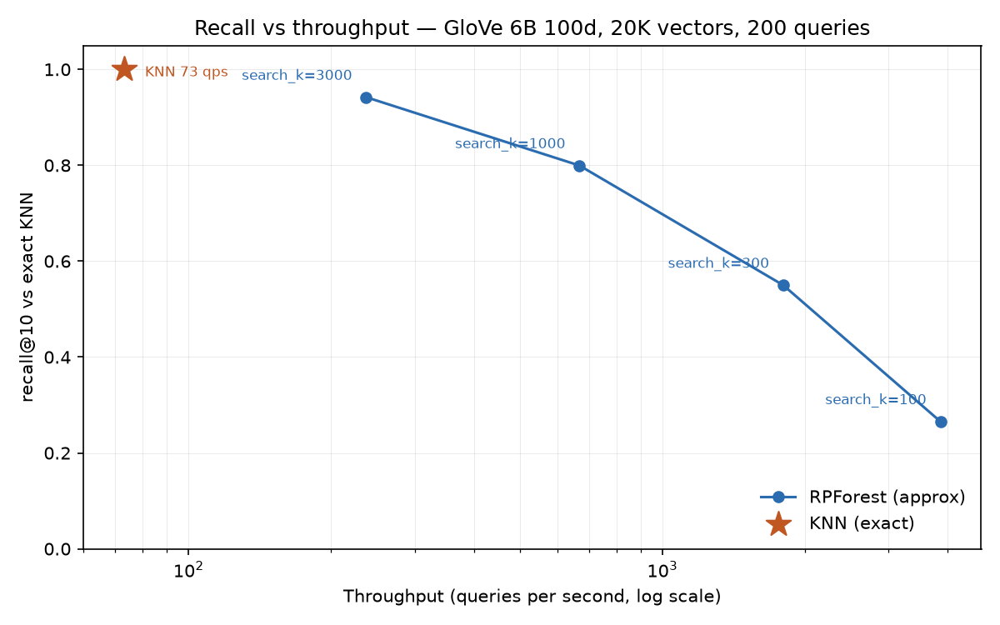

# VecSearch

Ground-up implementations of vector search with pure Python and no dependencies

Started with brute-force KNN, then added a Random Projection forest for approximate search. Working toward graph-based ANNS: NSW and HNSW.



## How It Works

**KNN (Brute Force)** — `src/vecsearch/knn.py:5` — Scores every vector via a pluggable `Metric` (`src/vecsearch/metric.py:5`) and returns top-k with `heapq.nlargest` (`src/vecsearch/knn.py:21`). `O(n)` per query.

- `CosineSimilarityMetric` (`src/vecsearch/metric.py:10`) is a dot product on L2-normalized vectors, computed with `math.sumprod` (`src/vecsearch/metric.py:12`) rather than a Python-level loop.
- Normalization happens on load in `src/vecsearch/io.py:23-27`; zero-norm vectors are skipped at `src/vecsearch/io.py:24`.
- OOV query words raise `ValueError` (`src/vecsearch/knn.py:12`), which the CLI catches and reports without exiting (`src/vecsearch/__init__.py:23`).
- The CLI lowercases the query word (`src/vecsearch/__init__.py:19`), so `King` resolves against the lowercase GloVe vocab.

**RPForest (Approximate)** — `src/vecsearch/rpforest.py:54` — Splits the vector set with random hyperplanes until every leaf holds at most `leaf_size` words, across `n_trees` independent trees.

- **Splits are just unit normals.** The plane bisecting two randomly sampled data points is perpendicular to `a - b`, and since `|a| = |b| = 1` it passes through the origin — so a split needs no offset term, only a normal vector (`src/vecsearch/rpforest.py:99-105`). Normalizing that normal to length 1 makes every routing dot product also the signed distance to the plane, which the search reuses as its priority. This depends entirely on the loader's L2 normalization; unnormalized vectors would need a real offset.
- **Building** is a plain recursion (`src/vecsearch/rpforest.py:124`) that stops at `leaf_size` or when a plane can't separate the points, in which case it keeps an oversized leaf rather than recursing forever. Trees are drawn from a seeded RNG, so builds are reproducible.
- **Searching** explores all trees at once with a best-first heap keyed on the largest plane margin crossed to reach a node (`src/vecsearch/rpforest.py:209-237`). Following the query's own side is free; taking the far side costs that margin, so a query sitting almost on a plane gets both sides explored early — which is exactly when the split was a bad one. A monotonic tiebreak counter keeps Python from comparing node objects on equal costs.
- **Leaves produce suspects, not answers.** The tree phase only collects candidate words; re-scoring them with the real metric is the single point where the injected metric is called (`src/vecsearch/rpforest.py:239-245`). Recall therefore depends on how many candidates get rescored, which is what `search_k` controls.
- `search_k` is the recall/speed knob, analogous to Annoy's, defaulting to `k * n_trees` (`src/vecsearch/rpforest.py:199-200`).
- `add()` inserts a vector into every tree and re-splits an overfull leaf, never altering existing planes (`src/vecsearch/rpforest.py:144-179`). Cheap, but a tree built on old data won't adapt if the distribution shifts much; rebuild after large insertions.
- `find_closest` (`src/vecsearch/rpforest.py:247`) matches `KNN.find_closest`'s signature so the bench harness drives both indexes unchanged.

## Project Structure

```
vecsearch/
├── src/vecsearch/
│   ├── knn.py      # Brute-force KNN
│   ├── rpforest.py # Random Projection forest (approximate)
│   ├── bench.py    # Recall/latency harness
│   ├── metric.py   # Metric ABC + CosineSimilarity
│   ├── io.py       # GloVe loader + L2 normalization
│   └── __init__.py # CLI entry point
├── data/
│   ├── glove.6B.100d.txt  # gitignored
│   └── truth_*.json       # Cached ground truth, committed
├── docs/
│   └── recall-vs-qps.png  # Generated plot, committed
├── results/       # Timestamped benchmark runs, committed
├── scripts/
│   └── plot_results.py    # Renders docs/ from results/
└── pyproject.toml
```

## Installation

Requires Python >=3.13 and [uv](https://docs.astral.sh/uv/).

```bash
uv sync
```

Download GloVe 6B 100d to `data/`:

```bash
mkdir -p data
curl -Lo data/glove.6B.zip https://nlp.stanford.edu/data/glove.6B.zip
unzip -o data/glove.6B.zip glove.6B.100d.txt -d data/
```

`.gitignore` covers only `data/glove.*`, so the downloaded vectors stay untracked while the cached ground truth, `results/` runs, and the generated plot are committed.

## Usage

### CLI

```bash
uv run vecsearch
# Data loaded
# KNN Constructed
# How many?: 5
# Word: king
# queen
# ...
```

The CLI prints neighbor words only, without scores.

`DATAPATH` and `PERCENTAGE` are configured in `src/vecsearch/__init__.py:6-7`. The CLI loads 100% of the vocabulary by default; the benchmark defaults to 5% for faster iteration.

## Benchmark

`vecsearch-bench` measures recall against exact KNN, throughput, and the work each index actually performs per query.

```bash
uv run vecsearch-bench --label baseline
# 20000 vectors
# Reusing cached ground truth: data/truth_glove.6B.100d_0.05_200_10_0.json
# knn     {}                 recall@10=1.000 qps=73.8 total/q=19999
# Results written to results/20260928_223051_baseline.jsonl
```

| Flag | Default | Purpose |
| --- | --- | --- |
| `--percent` | `0.05` | Fraction of vocabulary to load |
| `--queries` | `200` | Number of random query words |
| `--k` | `10` | Neighbors per query |
| `--seed` | `0` | Seeds query sampling |
| `--label` | `run` | Label embedded in the output filename |

### Metrics

- `recall@k` — overlap with the exact top-k, where brute-force KNN is the ground truth.
- `qps` — queries per second.
- `dist_per_query` — full metric evaluations per query, counted by the `CountingMetric` wrapper (`src/vecsearch/bench.py:19`) that decorates the real metric.
- `plane_per_query` — hyperplane routing dot products per query, tree indexes only. `RPForest` calls `math.sumprod` directly to route, so `CountingMetric` never sees that work; the index tallies it in `self.plane_evals` (`src/vecsearch/rpforest.py:74`) and `evaluate` resets it each sweep (`src/vecsearch/bench.py:80-81`). Zero for KNN.
- `total_per_query` — `dist + planes` (`src/vecsearch/bench.py:98`), and the number to compare indexes on. `dist_per_query` alone flatters the forest, since the plane traversal it omits is roughly half the forest's work at the cheapest setting. KNN does no routing, so its `total` equals its `dist`.

`build_s` records index construction time separately, which matters for NSW and HNSW where build is the expensive phase. It's negligible for both current indexes — the forest builds in ~1.6s for 20K vectors.

### Ground Truth Cache

Exact top-k per query is cached to `data/truth_<dataset>_<percent>_<queries>_<k>_<seed>.json` (`src/vecsearch/bench.py:46`). The cache is keyed on a `meta` block covering every parameter that affects the result; if any differ from the current run it is recomputed and overwritten. The first run pays full brute-force cost, later runs are instant.

### Output

One JSON object per parameter sweep is appended to `results/<timestamp>_<label>.jsonl`, so repeated runs accumulate into a shared history.

### Adding an Index

Register each index in the `runs` list at `src/vecsearch/bench.py:123-131` as a `(name, build_fn, param_sweeps)` triple. Each sweep dict is splatted into `find_closest`, which is how `search_k` is varied for the forest and how `ef` will be varied once NSW lands:

```python
runs = [
    ("knn", lambda: KNN(data, counter), [{}]),
    (
        "rpforest",
        lambda: RPForest(data, counter, n_trees=10, leaf_size=32),
        [{"search_k": s} for s in (100, 300, 1000, 3000)],
    ),
    # ("nsw", lambda: NSW(data, counter, M=16), [{"ef": e} for e in (10, 20, 50, 100)]),
]
```

An index that does work outside the injected metric should expose a `plane_evals` counter; `evaluate` detects it with `hasattr` (`src/vecsearch/bench.py:80-81`) and folds it into `total_per_query`. Without that counter the index silently under-reports its own cost.

`bench.py` carries its own `DATAPATH` at `src/vecsearch/bench.py:14`, independent of the CLI's.

## Results

GloVe 6B 100d at 5% (20,000 vectors), 200 queries, k=10, from `results/20260929_013402_rpforest.jsonl`. The forest is built with `n_trees=10`, `leaf_size=32`.

| index | `search_k` | recall@10 | qps | dist/q | plane/q | total/q |
| --- | --- | --- | --- | --- | --- | --- |
| knn | — | 1.000 | 74 | 19999 | 0 | 19999 |
| rpforest | 100 | 0.266 | 3862 | 109 | 105 | 215 |
| rpforest | 300 | 0.550 | 1799 | 309 | 138 | 447 |
| rpforest | 1000 | 0.800 | 668 | 1009 | 268 | 1277 |
| rpforest | 3000 | 0.942 | 237 | 3007 | 561 | 3567 |


Regenerate the plot after new runs land — it reads every `results/*.jsonl` and averages the KNN rows into a single baseline:

```bash
uv run --with matplotlib python scripts/plot_results.py
```

matplotlib is pulled in ephemerally rather than added to `pyproject.toml`, keeping the project dependency-free.

Reading the sweep: the tradeoff is steep and predictable. At `search_k=3000` the forest returns 94% of the true neighbors at 3.2x the throughput of brute force, doing 5.6x less work per query. Pushing to `search_k=100` buys 52x throughput but recall collapses to 0.27 — past that point the candidates being rescored aren't drawn from the right regions, so extra work stops buying relevance. `search_k=1000` sits at 0.80 recall for 9x throughput and is the better default if you don't need the last 20% of recall.

Plane traversal is 49% of the forest's work at `search_k=100` but only 16% at `search_k=3000`. Reaching a leaf means descending all 10 trees, roughly 10 levels each, so every query pays ~100 routing dot products before it has collected any candidates at all. That fixed descent is amortized over more and more candidates as `search_k` grows, which is why cheap searches look so routing-heavy. It is also work `CountingMetric` cannot observe on its own, and the reason `total_per_query` exists.

## Dataset

[GloVe 6B 100d](https://nlp.stanford.edu/projects/glove/) — 400K vocab, 100-dim. Vectors are L2-normalized on load so dot-product == cosine similarity. Use `percent < 1.0` to subsample for faster iteration.
